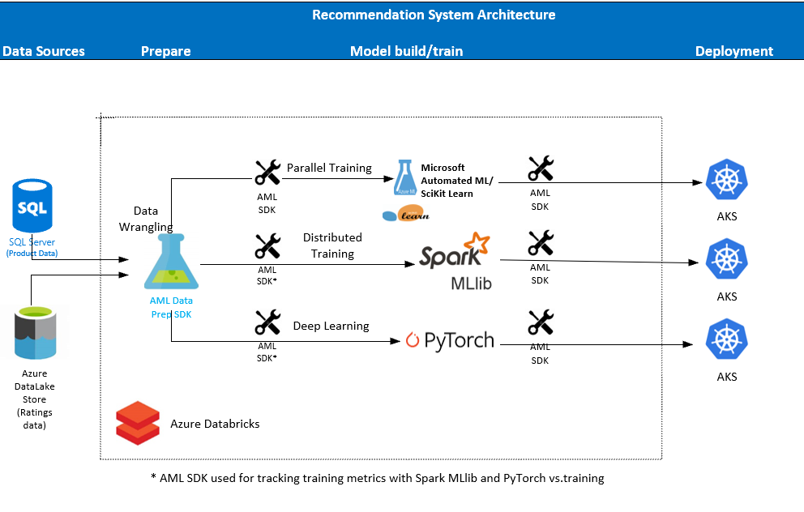
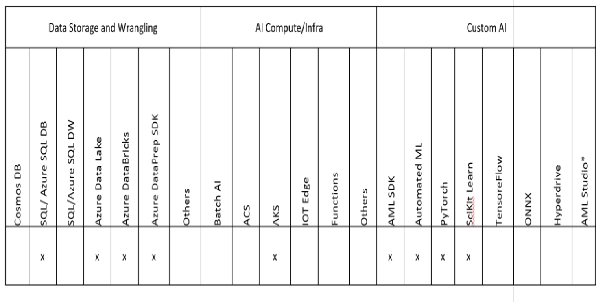

### About this course
In this course, you will learn to use multiple Azure AI tools and technologies to build a recommendation system for a retail scenario.  You will learn to use the AzureML Data Prep SDK with Azure Databricks to perform common data wrangling transforms and create optimized data sets for model development.  You will learn about the Automated Machine Learning capability within AzureML and use it with Azure Databricks to automatically generate multiple candidate models for a recommendation system. You will build an additional recommender model using classical techniques with Spark MLLib and perform distributed training. You will also learn to build a custom deep learning recommendation model using PyTorch.  Finally, you will learn to use the AzureML SDK from within Azure Databricks to deploy your models as Azure Kubernetes Services.
The skills you will learn in this course can be applied to building recommendation and personalization features in other domains including news, entertainment, insurance, and communications service providers.   

#### Step 1: Prepare your Data
The AzureML DataPrep SDK supports multiple out-of-the-box transforms (JSON expansion, derived columns, fuzzy grouping, autojoin, …) and file readers for multiple data formats.  You will work with the Adventure Works retail data set  containing the product catalog data and user purchase data stored in Azure SQL DB, and the product ratings data stored in Azure DataLake.  You will use AzureML DataPrep SDK to mount these data sets into Azure Databricks, apply transforms like auto join, fuzzy grouping, scalers and asserts, standardize keys and output a single aggregated data set optimized for training your models.  You will then use this as training data set in Azure Databricks in preparation for model development.

#### Step 2: Build your Models 
Automated Machine Learning  capability on Azure ML is an automated service that identifies the best machine learning pipelines for your labeled data and greatly helps with productivity saving time on trying out multiple algorithms. You will use this Automated Machine Learning capability of Azure ML in your Azure Databricks notebook to automatically generate multiple models, each using a different algorithm and a different set of features and identify the best model.
You will also build two other recommender models - one using classical techniques with Spark MLlib and perform distributed training on Azure Databricks and other using deep learning technique with PyTorch in your Azure Databricks notebook.

#### Step 3: Deploy your Models
You will use the Azure ML SDK in your Azure Databricks notebook to deploy the three models you have developed as Azure Kubernetes Services, each with a unique web service end point.  The consumption of these models for a retail product scenario is covered in the Designing and Implementing Customer Service Agent course. (Under development) 

#### Architecture

#### Technologies Covered

#### Industry application

Recommendation systems have a wide range of industry applications. Here are some examples: 

Ecommerce/Retail Stores – Almost every ecommerce retail site uses some form of recommender system for product suggestions, brand recommendations and targeted ads relevant to user behavior and product/brand ratings.

Entertainment – Video streaming companies heavily use recommendation systems to make personalized suggestions to viewers based on the usage patterns and ratings on the shows. Audio streaming companies use recommendation systems suggest weekly selections that aim at improving listener retention and increase usage. 

Insurance, Internet Service Providers, and Mobile/wireless companies – Recommendation systems are used to provide customers with optimized and economical service plans based on customer usage patterns enhancing customer loyalty. 

#### Pre-requisites

1.	Experience with [Python](https://www.edx.org/course/introduction-python-data-science-2#!) coding

2.	Experience with [VSCode](https://code.visualstudio.com/docs/languages/python) and/or [Jupyter notebooks](https://www.datacamp.com/community/tutorials/tutorial-jupyter-notebook)

3.	Be able to launch a [DataBricks workspace on Azure](https://docs.microsoft.com/en-us/azure/azure-databricks/quickstart-create-databricks-workspace-portal) and spin up clusters

#### Pre-setup before you attend this course:
1.	You need a Microsoft Azure account to create the services we use in our solution. You can create a [free account](https://azure.microsoft.com/en-us/free/), use your [MSDN account](https://azure.microsoft.com/en-us/pricing/member-offers/credit-for-visual-studio-subscribers/) or use any other subscription where you have permission to create services

2.	Install [Visual Studio 2017](https://visualstudio.microsoft.com/downloads/?utm_medium=microsoft&utm_source=docs.microsoft.com&utm_campaign=button+cta&utm_content=download+vs2017) /  [VSCode](https://code.visualstudio.com/) 

#### Course Details

Primary Audience: Data Scientists, Azure AI Developers, Architects
Secondary Audience: Any professional interested in Microsoft Automated ML, Recommendation Engines

#### Level
This is designed as an advanced level course for Data Scientists/ AI Developers / Architects

#### Type
This course in its full form is designed to be taught in-class, but you can also use the materials in a self-paced fashion. There are assignments, and multiple reference links throughout the materials that support the concepts and skills you will learn.

#### Length
Full Course class room training:  8 hours

#### Course Modules
This course is organized in following modules
1.	Introduction to recommendation systems ~ 15 min
2.	Recommendation System Techniques ~45 min
3.	Data Wrangling with Azure ML DataPrep SDK and Azure Databricks ~ 2 hrs
4.	Build multiple recommendation models using automated Machine Learning capability in Azure ML, classical model using Spark MLLib and  deep learning models using PyTorch ~ 4 hrs
5.	Deploy trained models to AKS ~ 30 min
6.	Discuss Learnings ~ 30 min

#### Other Resource
[Microsoft Automated Machine Learning capability with Azure ML](https://azure.microsoft.com/en-us/blog/announcing-automated-ml-capability-in-azure-machine-learning/)

# Contributing

This project welcomes contributions and suggestions.  Most contributions require you to agree to a
Contributor License Agreement (CLA) declaring that you have the right to, and actually do, grant us
the rights to use your contribution. For details, visit https://cla.microsoft.com.

When you submit a pull request, a CLA-bot will automatically determine whether you need to provide
a CLA and decorate the PR appropriately (e.g., label, comment). Simply follow the instructions
provided by the bot. You will only need to do this once across all repos using our CLA.

This project has adopted the [Microsoft Open Source Code of Conduct](https://opensource.microsoft.com/codeofconduct/).
For more information see the [Code of Conduct FAQ](https://opensource.microsoft.com/codeofconduct/faq/) or
contact [opencode@microsoft.com](mailto:opencode@microsoft.com) with any additional questions or comments.
